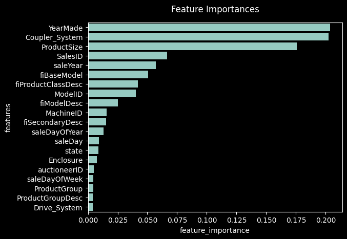

# **Bulldozer Price Prediction**

## The completed project is hosted as a separate Github repository [here](https://github.com/DarkDk123/Bulldozers-Price-Prediction).

 &nbsp;

## Predicting the Sale Price of Bulldozers using Machine Learning

The goal of the project is to predict the sale price of a particular piece of heavy equipment at auction based on its usage, equipment type, and configuration. The data is sourced from auction result postings and includes information on usage and equipment configurations.

### **1. Problem Definition**
> How well can we predict the future sale price of a bulldozer, given its characteristics and previous examples of how much similar bulldozers have been sold for?

### **2. Data**
The data is sourced from the Kaggle Bluebook for Bulldozers competition, officially available at [Kaggle](https://www.kaggle.com/c/bluebook-for-bulldozers/data).

There are three main datasets:

* **Train.csv**: The training set, which contains data through the end of 2011.
* **Valid.csv**: The validation set, which contains data from January 1, 2012 - April 30, 2012. Predictions are made on this set throughout most of the competition. Your score on this set is used to create the public leaderboard.
* **Test.csv**: The test set, which will not be released until the last week of the competition. It contains data from May 1, 2012 - November 2012. Your score on the test set determines your final rank in the competition.

### **3. Evaluation**

The evaluation metric for this competition is the RMSLE (Root Mean Squared Logarithmic Error) between the actual and predicted auction prices.

For more information on the evaluation of this project, refer to the [Kaggle Evaluation Page](https://www.kaggle.com/competitions/bluebook-for-bulldozers/overview/evaluation).

**Note:** The goal for most regression evaluation metrics is to minimize the error. For this project, our objective will be to build a machine learning model that minimizes the RMSLE.

### **4. Features**

Kaggle provides a data dictionary detailing all of the features in the dataset. You can view this data dictionary on Google Sheets:
[Data Dictionary](https://docs.google.com/spreadsheets/d/1YxAS_31T4N5u3AjQPnLF-mU4Txjm3RcA/edit?usp=sharing&ouid=117749036674598073372&rtpof=true&sd=true).

### **5. Key Achievements**

1. **Developed a Robust Scikit-Learn Preprocessing Pipeline**:
   - Created a comprehensive preprocessing pipeline that cleans, encodes, and scales input features.
   - Ensured consistency and efficiency in data preparation for machine learning models.

2. **Hyperparameter Tuning with Bayesian Optimization**:
   - Utilized the `skopt` library to perform Bayesian Optimization for hyperparameter tuning.
   - Achieved optimal model performance by fine-tuning hyperparameters effectively.
 
3. **Feature Importance Analysis**:
   - Identified and visualized feature importances to understand the impact of different features on the model's predictions.
   

   

### **Final Result**

As of Kaggle Evaluation metric, our best (lowest) **RMSLE (root mean squared log error)** is 0.28034804916595124.

This says we could have a rank of 75 on Kaggle leaderboard! But We couldn't know for sure, the competition is over now and we can't submit the "test predictions".