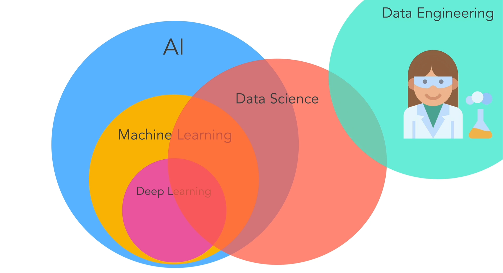
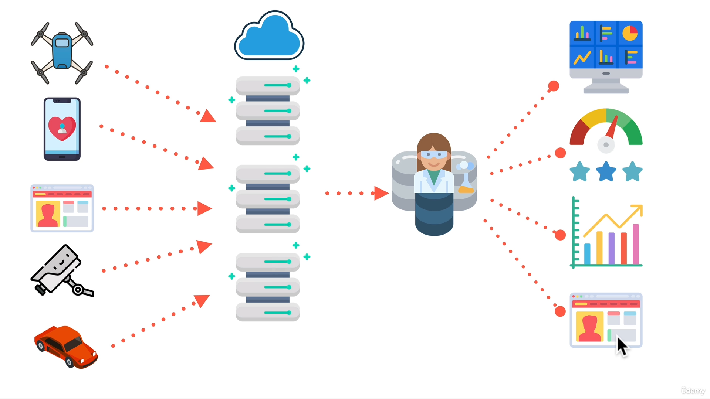
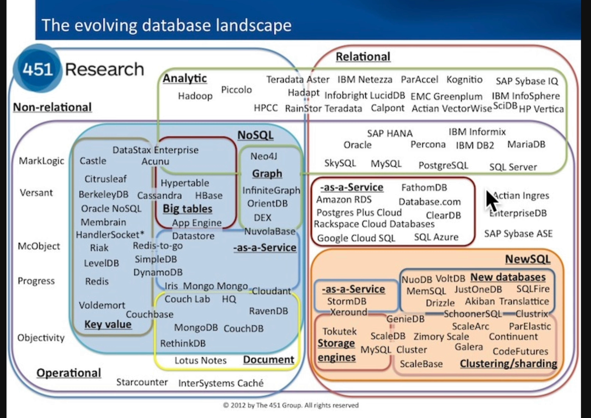
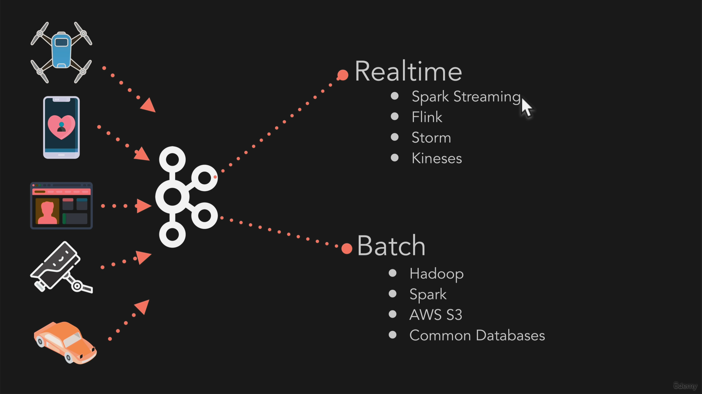

# Data Engineering 👨🏼‍🔬⛁

**Data Engineering** is the process of designing, building, and maintaining the systems and infrastructure that gather, store, process, and make data accessible for analysis. It focuses on creating pipelines that transform raw data into usable formats for data scientists, machine learning (ML) engineers, and analysts.

### Key contrasts:
- **Data Science (DS)** involves analyzing and interpreting data to derive insights, typically using statistics and machine learning algorithms. Data scientists rely on the clean, structured data provided by data engineers.
  
- **Machine Learning (ML)** focuses on building models that learn from data to make predictions or automate tasks. ML engineers depend on the work of data engineers to have high-quality, processed data for training and deploying models.

In essence, **data engineering** sets up the foundation and infrastructure, while **data science**, **machine learning** & **Analysts** extract insights and build models on top of that foundation.

**Other resources to learn from :**

- GeekForGeeks [article](https://www.geeksforgeeks.org/what-is-data-engineering/)
- DataCamp [article](https://www.datacamp.com/blog/what-is-data-engineering)

## Breaking down Data Engineering

**Question like:**

- Even what is data?
- Why Companies care about data & collecting it?
- Who actually are Data Engineers? what do they do?

Let's recap and understand in *Data Engineering* perspective!

### What is Data at it's Core?

Data is information in a structured or unstructured format. Data can be numbers, words, images, audio, video, or any other type of information. It can be generated from various sources such as sensors, logs, social media, or user interactions.

**Typical types of Data :**

- Structured Data
- Semi-structured Data
- Unstructured Data
- Binary Data

The first two types are most useful in predictive modelling and analysis tasks while others are used for more complex analysis & ML tasks *(i.e. Generative AI)*.

### Why Companies care about data?

Data is the new gold, most valuable companies in the world is **valuable** because they collect Data from their products, customers, tools etc.

They use that data to make better decisions, provide advertisement helps, and help other industrial sectors.

### What Data Engineers does?

Let's get a look at these 3 words first -

- **Data Mining** is the extraction of meaningful data & insights from any type of large data.

- **Big Data** is the data that can't be stored on a **single consumer computer**, and requires a Big storage and processing engine (often the Cloud), it encompasses [5 V's](https://www.coursera.org/articles/5-vs-of-big-data) : **Variety, velocity, volume, value, veracity.** 
  
  The resource need of *big data* is satisfied with Distributed computing technologies like Apache hadoop, NoSQL DBs etc.

- **Data Pipeline** is the streamlined end-to-end data infrastructure, that handles raw data from different sources, processes it, and provides to other users *(i.e. Data Analysts, Data Scientists, ML Engineers)* in neatly organized forms 

 

There are a lot of different phases of Data Pipelines that a **Data Engineer build** like, data ingestion, data pools, data warehouses etc.

Learn more about them : [RedPanda](https://www.redpanda.com/guides/fundamentals-of-data-engineering-data-pipeline-architecture), [DataCamp](https://www.datacamp.com/tutorial/introduction-to-data-pipelines-for-data-professionals).

**Hence, Data Engineers design, build & maintain these data Pipelines to continue data-driven applications smoothly.**

There are many different tools & technologies used in Data Engineering, we will not practically learn them in this course for now.

But definitely I'll learn them as needed, stay updated with my [Github profile !](https://www.github.com/DarkDk123)

Let's know about few of them!

## Tools & Technologies in Data Engineering

#### **Databases**

There are many different types of databases for specific use-cases, see the below picture 😆🫨

 

Let's simplify them into few categories!

1. **Relational DataBases** - Traditional DBs for ACID Transactions using SQL.

2. **NoSQL DataBases** - Databases supporting horizontal scaling , allowing semi-structured & unstructured data. ([ref](https://www.mongodb.com/resources/basics/databases/nosql-explained)).

3. **NewSQL DataBases** - Best of both, having distributed nature for scaling while still maintaining strict ACID properties. ([ref](https://www.baeldung.com/sql/database-newsql-intro)).

Based on their usage, databases are also categorized into two types: 

- **OLTP (Online Transaction Processing)**
- **OLAP (Online Analytical Processing)**.

Also, sometimes they are categorized based on their strength like **Searching** or **Storing** etc.

Learn more here [1](https://techdifferences.com/difference-between-oltp-and-olap.html), [2](https://www.yugabyte.com/acid/).

### Learning SQL

As we learned, SQL is really a powerful tool for data analysis.\
And required when doing a **Data Job**.

We all must learn it, it is simple yet powerful.

I have a dedicated repository for all of my [SQL Learnings](https://github.com/DarkDk123/Learning-SQL) & also look at [here](https://www.khanacademy.org/computing/computer-programming/sql/sql-basics/v/welcome-to-sql).

### Other Tools

The **Apache ecosystem** is really Great for **Big Data & Data engineering**:

- **Apache Hadoop** - A framework for distributed computing, allowing you to process really large datasets on clusters of computers. It's really powerful for data processing!

  - **HDFS (Hadoop Distributed File System)** - A distributed file system that allows you to store and retrieve large amounts of data. It's a key component of Hadoop.
  - **MapReduce** - A programming model and software framework that allows you to process data in parallel on multiple machines. It's a key component of Hadoop.

- **Apache Hive** - A data warehousing and SQL-like query language for Hadoop. It's a way to write SQL queries on top of big data, and get the results back in a structured format.

    
    
Figure: Apache Hive Metastore

- **Apache Spark**: A unified analytics engine for large-scale data processing. It provides high-level APIs in Java, Scala, Python, and R, and an optimized engine that supports general computation graphs for data analysis. Spark can handle batch processing and stream processing, allowing it to process large datasets quickly and efficiently across clusters of computers.

- **Apache Kafka**: A distributed event streaming platform capable of handling trillions of events a day. It is used to build real-time data pipelines and streaming applications. Kafka is designed for high throughput, low latency, and fault tolerance, making it suitable for scenarios where data needs to be processed in real-time as it arrives.

- **Apache Flink**: A stream processing framework that provides high-throughput, low-latency, and accurate event processing. It is particularly well-suited for event-driven applications and is capable of handling both batch and stream processing. Flink's stateful computation and fault tolerance make it a powerful tool for real-time data analytics.

---
**Definitely, all of these will be overwhelming at first, it is a whole different & interesting field, most of these tools are extensions of each other to solve existing problems.**

**Consider learning them independently as you go on new things!!**

❤️‍🔥🤗
---