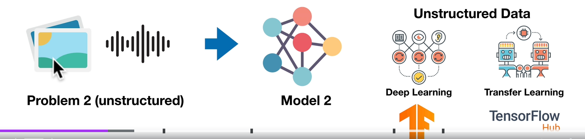
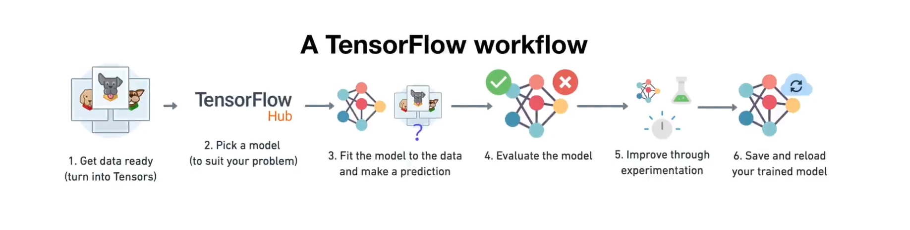

# Deep Learning & Neural Networks  

**Deep Learning** and **Neural Networks** are the driving forces behind the advancements in today's **AI landscape**.  
We’ll explore these concepts through an **end-to-end project** where we’ll develop a Neural Network.  

To begin, let’s understand a few key topics:  

## Deep Learning  

Deep Learning is a subset of machine learning that uses a powerful set of algorithms capable of learning **complex data patterns** through **deep layers of interconnected nodes**, commonly referred to as **neural networks**.  
It is widely used for tasks such as **classification**, **regression**, and **representation learning**.  

## Neural Network  
*(also known as Artificial Neural Network or Neural Net)*  

A **Neural Network** is a computational model inspired by the structure and functioning of biological neural networks.  
It consists of layers of interconnected **neurons** (nodes), where each neuron *(a specific model)* performs a specific computation to process data and learn patterns.  

They train on **large datasets** to learn ***weights*** that represent underlying patterns & relationships of data points.

---

### Common Deep Learning Problems  

- **Classification**: Assigning labels to data points, such as image classification or sentiment analysis.  
- **Sequence-to-Sequence (Seq2Seq)**: Translating input sequences to output sequences, like machine translation or text summarization.
- **Object Detection**: Identifying and locating multiple objects in images or videos.  
- **Regression**: Predicting continuous values, such as house prices or stock trends.  
- **Clustering**: Grouping similar data points, often used in unsupervised learning.  
- **Anomaly Detection**: Identifying unusual patterns or outliers, like fraud detection.  
- **Recommendation Systems**: Suggesting items based on user preferences, such as movies or products.  

With the help of Deep neural networks, this problems can be solved robustly.

## Tools & Libraries

There are various Deep Learning Libraries, providing easy interfaces to develop neural networks. And also many pretrained models and datasets.

### [TensorFlow](https://www.tensorflow.org/) :

**TensorFlow** is an open source Deep learning framework by google, designed for Numerical computation,
Deep learning & Artificial Intelligence tasks. It provides tools to build, train and deploy models at scale.
It supports a wide range of tasks like image recognition, NLP & Predictive Analytics, it excels at tasks
where unstructured data could be used for training and predictions.

It can work on data formats like **CSVs, images, audio, text and video** for better performance.

### [PyTorch](https://pytorch.org/) :

**PyTorch** is an open-source deep learning framework developed by Facebook. It is widely used for creating and training neural networks, **offering flexibility**, dynamic computation graphs, and GPU acceleration.

PyTorch excels in **research and production** for both structured and unstructured data processing.

### [Google Colab](https://colab.research.google.com/):

Google Colab is a free, cloud-based environment for creating and executing code in a Notebook like interface with Google's Cloud Compute resources i.e. free GPU/TPUs, pre-installed workflow & libraries.

We'll use Google Colab throughout the project to train our network quick with GPU support.

---

# Dog Breed Classification

We're going to build a ***multi-class image classification*** model to classify the breeds of a dog, given an image of a dog.\
As this (images) is unstructured data, we'll preprocess data accordingly to it.

This is a **Kaggle Project**, is given on [Kaggle platform](https://www.kaggle.com/c/dog-breed-identification/overview) as **Dog Breed Identification** challenge.

The project is hosted as a separate repository in it's own, [here](https://github.com/DarkDk123/Dog-Breed-Classification).