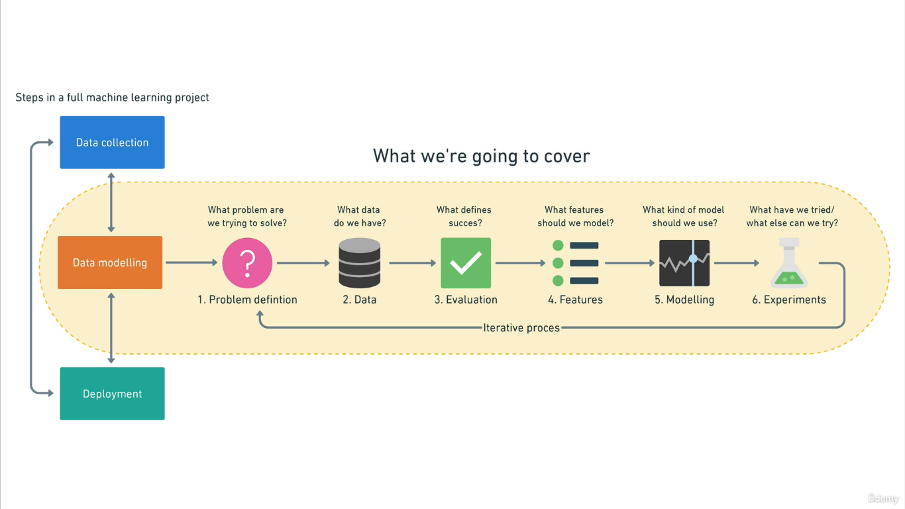
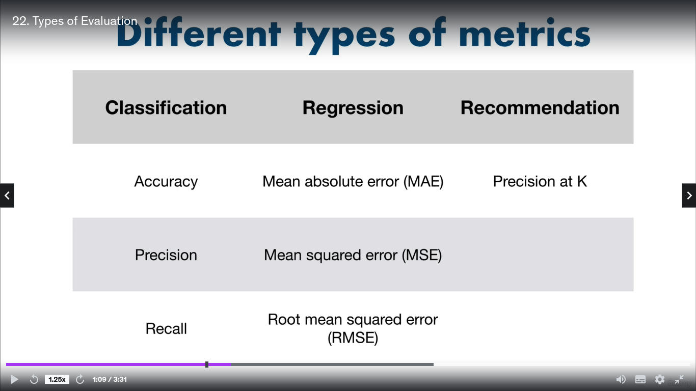
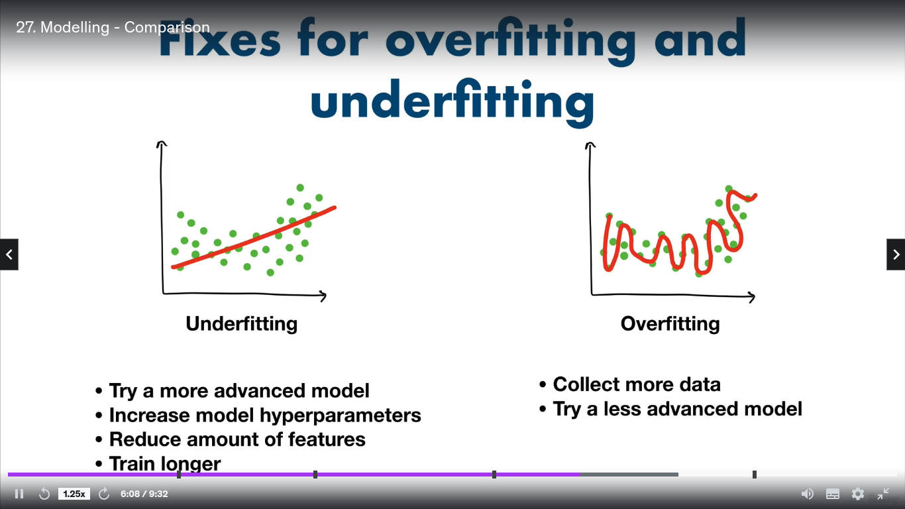
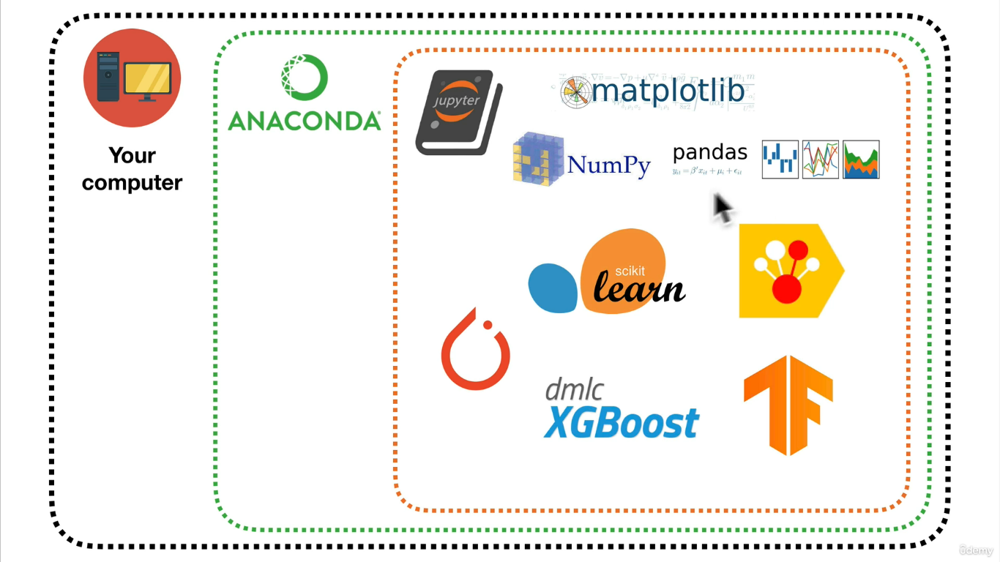
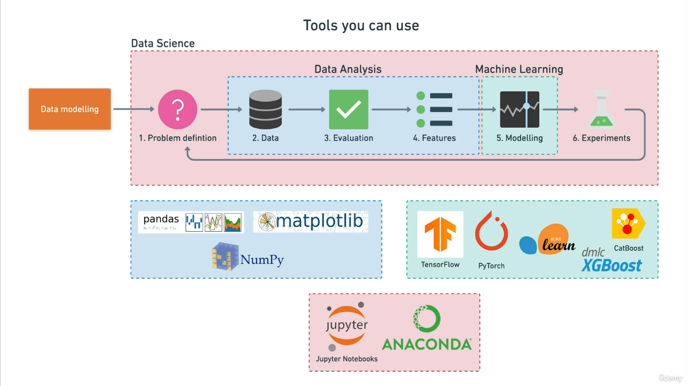

.# Creating a FrameWork : 🚀📚

A FrameWork or Template will Standardize the approaches & steps followed in a real-world **ML & DS** project. 📊🔍

We will get in detail ML & DS Framework.

We will majorly follow the projects approach, learning by doing projects. 👨‍💻🏗️

## ML &  Data Science Framework : 🤖📚

## **1. Problem Identification :** 🎯
* What category of problem we are dealing with ?? 🤔
* What Actual Problem we have to tackle ? 🤨

#### At First, we must understand the problem or even it need Machine Learning to be solved?? ❓
Choose a Simple hand-coded Systems if you can. 👨‍💻

Use ML only if the problem is hard to explain in instruction steps. 🧠

#### Understand the Problem & try to map it with most common ML Problems, try to categorize them among the following common problems. 🔍

1. **Supervised Learning :** In these problems, we have the data with required inputs and mapped outputs to them. 

    Based on this multiple **inputs -> Output** pairs the ML Algorithm tries different patterns until it gets the same output in the training data then it completes it's training. 🔄
    
    ### It has mainly 2 types of subproblem: 📋

    **A. Classification :** It tends to Classify things into different classes/categories. Simply tells the "input" belongs from this type or another. 🗂️
    
    They are further divided based on the number of classes to predict.

    **B. Regression :** It typically predicts a **number**, based on other variables the target would represent how much value. 📉

    It quantifies all variables to predict the numerical value of target.

2. **Unsupervised Learning :** By the name, these problems contain data that is unlabelled, we don't know what to predict!. 🤷‍♂️

That way we directly understand the patterns in data, commonalities in the data points and then we label them acc. to our need.

#### This Problems contain following common problems: 🗃️

**A. Clustering :** Creating different groups of data based on their similarities.

**B. Association rule Mining :** It understands the frequency of pairs of data points, by getting this combinations of data points. It provides the necessary associations & relations among data points.

3. **Transfer Learning :** It is the type of learning which is transferred from a pre-trained model.

    It's used in case when we know, we can use Learnings by previous models to make our new model excellent. This Learnings from one model is **transferred** to another model. 🔄

4. **Reinforced Learning :** When we want our machine to master one thing based on its wins & losses, we give it rewards if it does something good, else we punish it. 
   
    This way machine try to maximize the reward and learns to do the best for maximum rewards. 🎮🏆

## **2. Data** 📊📈

* Understand what kind of **Data** we have? 🤔

Looking broadly, data may come in various different formats. 📁📝

The main two types are: **Structured & Unstructured.** 📊📄

* **Structured Data:** The data that follows a particular schema or structures. 🗂️

    Like CSV files, Table data, excel & google sheets etc. 📋📊

* **Unstructured Data:** Data that doesn't show any common structures, it can come in several formats. 📁🚫🗂️

    Like Audio, Video Files, transcribed audios, Images etc. 🎵🎥📸

#### Also Data may differ in types based on their collection or velocity. Like: ⚡📅

* **Static Data:** The data which remains the same and doesn't change so frequently. i.e. Historical Data for Analysis. 📆📈

* **Streaming Data:** Data which changes so frequently and needs continuous updates. The Data which is used in a prediction which requires live data. i.e. **Daily News Data for Stock Prediction.** 🗞️📊

## **3. Evaluation (Goal) :** 🎯📈

* What Success means for us? 🏆💡
* What result we want from our project? 🚀🔍

We have to get a rough idea about what we expect from our model, how accurate results we want. 📊🧠

This must not be exact a numerical value. **Evaluation** may change based on the data we have & the conditions we face throughout our analysis. 🔄📈

Common Evaluation metrics are given below that are used to check a model's performance: 📏📊

 📊📉

* We will learn all of them later! 📚🔜

## **4. Features in Data:** 📊📋

Features refer to the variables or properties of data that are used to predict the target variable. 🎯📈

They are also called independent variables used in ML models to predict target/independent variables. 🔍🧠

**Feature Engineering:** When we figure out what features to use, transform existing features, or create new features. Means the overall process of getting features ready for our project is called Feature Engineering. 🛠️📊

#### Types of Features: 📝🔢

There are mainly 2 types of features: 

**1. Numerical (Quantitative):** These are the features consisting of numerical values. 🔢📈

**2. Categorical (Qualitative):** The features which denote few categories of a value. i.e. **True/False, Male/Female, or Country names** etc. 📊🗂️

**Derived Features:** The features created by ourselves based on existing available features, or modified existing features are called Derived Features. 🔄🛠️

* Good & Efficient Features are very important to build good ML Models. 👍🏆
* A particular Feature must be in a large number of records to be considered as Features. 💡📊
## **5. Data/ML Modelling :** 🛠️🤖

The Modelling process in ML refers to the overall steps taken in the finalization of a ML Model or ML Algorithm used. 📈🤖

This Modeling contains crucial steps like:

* We process data for creating models, Splitting data into train, test sets is called Data **Modelling** 📊🔍

1. **Choosing the Right model :** Choose right, relatable model to be used. The **Training Data Set** is used to train this. 🎯🔧
   
2. **Tuning/Improving the model :** We validate our model, whether it's considerable or not, we Fine tune it until it meets content requirements. **Normally 10-15% of original data is used to validate.** 🔄🔍💻
   
3. **Test & Compare the Model :** After validating the Model is tested & Evaluated on a **Test DataSet (10-15% of original data)**. Different Models are compared at Test Stage to find the Best. 📝🔍📊

### Generally, we split the Actual Data into 2 parts only.
#### i.e. Training & Testing Data. 📊🔍

#### In Training & Testing models, we can face multiple problems Like OverFitting & UnderFitting. 📉📈

Poor performance on the training data means the model hasn’t learned properly and is **underfitting**. Try a different model, improve the existing one through hyperparameter or collect more data. 📉📝🔧

* UnderFitting can occur due to **"Data Mismatch"** of Training & Test Sets.
* Or the less amount of Training data doesn't provide many patterns to ML model for learning.

Great performance on the training data but poor performance on the test data means your model doesn’t generalize well. Your model may be **overfitting** the training data. Try using a simpler model or making sure your test data is of the same style your model is training on. 📈📝🤖

* OverFitting can occur due to **"Data Leakage"** from testing to training sets. (Improper Splitting of DataSet)
* OverFitting can occur due to a complex model that learns too many patterns & always predicts pretty much the same as training data.

#### Fixes to Under & Over Fittings. 🔧📉📈

## **6. Experimentation :** 🧪📊

* What we have tried? is it good? 🤔👍
* What else we can try? 🤔🔍

In Experimentation, we just try to look more different ways to improve our model, by doing experiments, changing some processes, we can make our model more efficient. 💡🔬

---
## Data Science WorkFlow : 📊🔍🧹🔄

A common Data Science WorkFlow contains many of the ML Framework Components.
Instead All of it is Data Science (We are making use of Data!!)

Data Collection, Cleaning, transforming, Data Splitting, and getting data ready for Model comes under Data Science WorkFlow. 📊🧹🔄

In Previous Steps: **Data, Evaluation & Features** we will be using Data Science tools & methods.

## The Following Tools we will use in our projects majorly.

